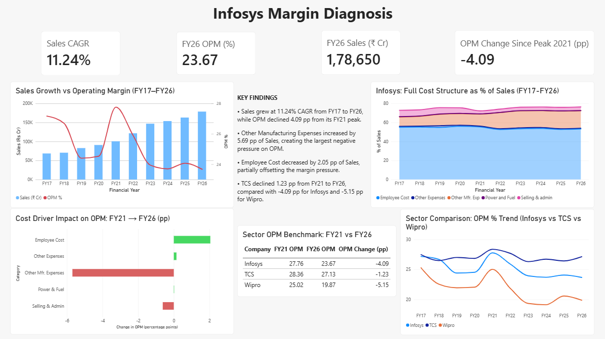

# 📉 Infosys Margin Diagnosis: Why Growth Didn't Translate to Profitability

## 📑 Table of Contents

- [Project Overview](#-project-overview)
- [Project Highlights](#-project-highlights)
- [Project Metrics](#-project-metrics)
- [Business Problem](#-business-problem)
- [Objectives](#-objectives)
- [Dataset](#-dataset)
- [Tools & Technologies](#-tools--technologies)
- [Project Workflow](#-project-workflow)
- [Data Cleaning & Preparation](#-data-cleaning--preparation)
- [Analysis Approach](#-analysis-approach)
- [Key Performance Indicators (KPIs)](#-key-performance-indicators-kpis)
- [Dashboard Preview](#-dashboard-preview)
- [Key Business Insights](#-key-business-insights)
- [Sector Benchmarking](#-sector-benchmarking)
- [Recommendations](#-recommendations)
- [Project Structure](#-project-structure)
- [How to Run](#-how-to-run)
- [Limitations](#-limitations)
- [Future Improvements](#-future-improvements)
- [Author](#-author)

---

## 📌 Project Overview

This project investigates a real, counter-intuitive financial pattern at Infosys Ltd: **Sales grew consistently for a decade, yet Operating Profit Margin declined.** Rather than assume a cause, this project sources real financial data, builds a repeatable cleaning and analysis pipeline in Python, decomposes the cost structure to isolate the actual driver, and benchmarks the finding against two industry peers (TCS, Wipro) to check whether it's a company-specific issue or an industry-wide pattern.

The project combines **Python** for data extraction, cleaning, metric calculation, and diagnostic visualization, with **Power BI** for an interactive, presentation-ready dashboard.

---

## 🌟 Project Highlights

- 📥 Sourced real financial statements directly from Screener.in (not a pre-cleaned Kaggle dataset)
- 🧹 Built a repeatable Python pipeline to extract and clean multi-year annual P&L data from raw Excel exports
- 🔍 Decomposed the full cost structure (5 cost lines) as a % of Sales to isolate the actual margin driver
- 📊 Found a specific, data-backed finding: Other Manufacturing Expenses increased by 5.69 percentage points of Sales and was the largest negative contributor to the OPM decline
- 🏢 Benchmarked the finding against TCS and Wipro to test whether the pattern is company-specific or sector-wide
- 📈 Built an interactive Power BI dashboard with KPIs, diagnostic charts, peer benchmarking, and a key findings panel
- 💡 Delivered 4 specific, actionable management recommendations grounded in the data

---

## 📊 Project Metrics

| Metric | Value |
|---|---:|
| Period Analyzed | FY17 – FY26 |
| Sales CAGR | 11.24% |
| Peak OPM (%) | 27.76% (FY21) |
| Latest OPM (%) | 23.67% (FY26) |
| Margin Decline (Peak to Latest) | -4.09 percentage points |
| Employee Cost % of Sales (FY21 → FY26) | 55.29% → 53.24% (-2.05 pp) |
| Other Mfr. Exp % of Sales (FY21 → FY26) | 12.74% → 18.43% (+5.69 pp) |
| Peer Companies Benchmarked | TCS, Wipro |

---

## 🎯 Business Problem

A company can grow its revenue every single year and still become **less profitable per rupee earned** — and most surface-level financial reporting doesn't explain why. Without a proper cost decomposition, it's easy to assume the obvious culprit (wage inflation) without checking whether the data actually supports that assumption.

This project asks a specific, falsifiable business question:

> **Why did Infosys's OPM decline from FY21 to FY26 despite consistent revenue growth, and what should management do about it?**

---

## 🎯 Objectives

- Source real, multi-year financial statement data for a target company
- Build a clean, reusable data extraction pipeline from raw Excel exports
- Calculate Operating Profit Margin and decompose it into its underlying cost drivers
- Identify which specific cost line is responsible for margin compression
- Benchmark the finding against industry peers to test generalizability
- Visualize the full diagnosis in both Python (static) and Power BI (interactive)
- Translate the diagnosis into concrete, management-actionable recommendations

---

## 📂 Dataset

**Source:** [Screener.in](https://www.screener.in) — free financial data platform for Indian listed companies

**Companies analyzed:**
- **Infosys Ltd** (primary subject) — full annual P&L, FY17–FY26
- **TCS** and **Wipro** (peer benchmark) — annual OPM%, FY17–FY26

**Data used:** Consolidated annual Profit & Loss statements, including Sales, Employee Cost, Other Manufacturing Expenses, Selling & Administration expenses, Other Expenses, Power & Fuel, and Net Profit.

---

## 🛠 Tools & Technologies

- Python
- Pandas
- OpenPyXL
- Matplotlib
- Power BI (including DAX measures)
- VS Code
- Excel (raw data export format)

---

## 📊 Project Workflow

1. Source annual financial data from Screener.in (Export to Excel)
2. Extract the annual Profit & Loss section from the multi-section raw workbook
3. Clean and reshape the data into a tidy, analysis-ready table
4. Compute derived metrics: Operating Margin %, cost lines as % of Sales, YoY growth, Net Margin
5. Diagnose the margin decline by comparing each cost line's movement over time
6. Visualize the diagnosis in Python (3 charts)
7. Repeat lightweight extraction for 2 peer companies (TCS, Wipro)
8. Build Power BI dashboard with KPIs, diagnostic charts, sector benchmarking, and a key findings panel
9. Benchmark Infosys's pattern against peers to test company-specific vs. sector-wide causes
10. Document findings and recommendations

---

## 🧹 Data Cleaning & Preparation

Screener's raw Excel export bundles multiple sections (Balance Sheet, Cash Flow, Quarterly Results, Annual P&L) into a single sheet, with several row labels (e.g. "Sales", "Report Date") repeated across sections. Cleaning required:

- **Section isolation:** Programmatically locating the row boundaries of the annual "PROFIT & LOSS" section (between the "PROFIT & LOSS" and "Quarters" markers) to avoid accidentally mixing annual and quarterly figures
- **Reshaping:** Transposing the sheet from a "line-items as rows, years as columns" layout into a tidy "years as rows, line-items as columns" table, suitable for time-series analysis
- **Type correction:** Explicitly converting columns to numeric and datetime types, since transposed data defaults to generic object type in pandas
- **Handling missing data:** Some cost lines (e.g. Power & Fuel for TCS) are not reported by every company; missing values were treated as zero when aggregating total costs, rather than allowed to propagate as NaN
- **Label standardization:** Converting raw report dates (e.g. `2017-03-31`) into standard fiscal year labels (`FY17`)

---

## 🔍 Analysis Approach

Rather than assuming a cause for the margin decline, each reported cost line was expressed as a **% of Sales** for every year. This normalizes for revenue growth and isolates changes in cost *efficiency*.

To quantify the FY21–FY26 margin compression, the change in each cost category's % of Sales was compared against the 4.09 percentage-point decline in OPM. Other Manufacturing Expenses increased by 5.69 percentage points of Sales, creating the largest negative pressure on margins. Employee Cost decreased by 2.05 percentage points and partially offset the decline. Selling & Admin contributed a further 0.62 percentage-point decline, while Other Expenses and Power & Fuel provided small positive offsets.

---

## 📈 Key Performance Indicators (KPIs)

- FY26 Sales (₹ Cr)
- Sales CAGR (FY17–FY26)
- FY26 OPM (%)
- OPM Change Since Peak (FY21) (pp)

---

## 📷 Dashboard Preview

### Infosys Margin Diagnosis Dashboard



---

## 💡 Key Business Insights

- **Revenue growth remained strong:** Sales grew at 11.24% CAGR from FY17 to FY26, indicating that the margin pressure was not driven by a lack of revenue growth.
- **Operating margins compressed:** OPM peaked at 27.76% in FY21 and declined to 23.67% in FY26, representing a 4.09 percentage-point decline.
- **Other Manufacturing Expenses were the largest negative contributor:** The category increased by 5.69 percentage points of Sales from FY21 to FY26, creating the largest negative pressure on OPM.
- **Employee Cost partially offset the pressure:** Employee Cost decreased from 55.29% of Sales in FY21 to 53.24% in FY26, improving cost efficiency by 2.05 percentage points.
- **Other cost categories had smaller effects:** Selling & Admin increased by 0.62 percentage points, while Other Expenses and Power & Fuel decreased by 0.15 and 0.02 percentage points respectively, providing small positive offsets.
- **Sector context:** From FY21 to FY26, Infosys' OPM declined by 4.09 percentage points, compared with a 1.23 percentage-point decline for TCS and a 5.15 percentage-point decline for Wipro.
- **Overall diagnosis:** Infosys continued to grow revenue, but the increase in Other Manufacturing Expenses created significant margin pressure. The analysis therefore points to a **profitability-efficiency challenge rather than a revenue-growth problem**.

---

## 🏢 Sector Benchmarking

To assess whether Infosys' margin compression was consistent with broader sector trends, Operating Profit Margin (OPM) was compared with TCS and Wipro from FY17 to FY26.

The comparison shows:

| Company | FY21 OPM | FY26 OPM | Change |
|---|---:|---:|---:|
| Infosys | 27.76% | 23.67% | -4.09 pp |
| TCS | 28.36% | 27.13% | -1.23 pp |
| Wipro | 25.02% | 19.87% | -5.15 pp |

- Infosys' OPM declined by 4.09 percentage points from FY21 to FY26.
- TCS experienced a smaller 1.23 percentage-point decline over the same period.
- Wipro experienced a 5.15 percentage-point decline.
- The peer comparison provides context for Infosys' margin movement, while the detailed cost-driver decomposition is performed only for Infosys.


---

## ✅ Recommendations

1. **Investigate Other Manufacturing Expenses:** Other Manufacturing Expenses increased by 5.69 percentage points of Sales from FY21 to FY26 and was the largest negative contributor to the OPM decline. Management should break down this aggregated category internally to identify the specific sources of cost escalation.
2. **Improve cost efficiency:** Review the underlying components of Other Manufacturing Expenses and identify opportunities for cost optimization without affecting service quality.
3. **Set cost-efficiency targets:** Establish annual targets for Other Manufacturing Expenses as a percentage of Sales and monitor the metric alongside revenue and OPM growth.
4. **Protect the gains in employee-cost efficiency:** Employee Cost declined from 55.29% of Sales in FY21 to 53.24% in FY26, partially offsetting the margin pressure. Maintaining this efficiency while supporting business growth can help protect operating margins.

---

## 📁 Project Structure

```
infosys-margin-analysis/
│
├── Data/
│   ├── Infosys.xlsx
│   ├── TCS.xlsx
│   ├── Wipro.xlsx
│   ├── infosys_annual_clean.csv
│   └── sector_opm_comparison.csv
│
├── Scripts/
│   ├── extract_data.py
│   ├── quantify_driver.py
│   ├── visualize.py
│   └── sector_comparison.py
│
├── notebooks/
│   └── infosys_margin_analysis.ipynb
│
├── Outputs/
│   ├── chart1_sales_vs_margin.png
│   ├── chart2_cost_driver.png
│   ├── chart3_cost_structure.png
│   └── chart4_sector_opm_comparison.png
│
│
├── Dashboard/
│   └── Infosys_Margin_Dashboard.pbix
│
├── Images/
│   └── Dashboard.png
│
├── README.md
├── .gitignore
└── requirements.txt
```

---

## 🚀 How to Run

1. Clone the repository.
2. Install the required Python libraries: `pip install -r requirements.txt`
3. Ensure `Infosys.xlsx`, `TCS.xlsx`, and `Wipro.xlsx` are available in the `Data/` folder.
4. Run `Scripts/extract_data.py` to clean the Infosys data and generate `infosys_annual_clean.csv`.
5. Run `Scripts/quantify_driver.py` to quantify the contribution of each cost category to the OPM change.
6. Run `Scripts/visualize.py` to generate the three diagnostic charts.
7. Run `Scripts/sector_comparison.py` to generate the peer benchmark dataset and sector comparison chart.
8. Open `notebooks/infosys_margin_analysis.ipynb` in Jupyter Notebook or VS Code to explore the analysis, calculations, visualizations, and key findings.
9. Open `Dashboard/Infosys.pbix` in Power BI Desktop to explore the interactive dashboard.
---

## ⚠️ Limitations

- **Aggregated cost categories:** Other Manufacturing Expenses is an aggregated label in the source data. Public financial data does not provide enough detail to determine which individual components caused the increase.
- **No causal attribution within the category:** The analysis identifies Other Manufacturing Expenses as the largest negative contributor to the OPM decline, but it cannot establish which specific underlying expense was responsible.
- **Public financial data:** The analysis is based on publicly available annual financial data and therefore does not include internal operational metrics, contract-level costs, employee utilization, pricing, or client-level profitability.
- **Historical analysis:** The findings are based on FY17–FY26 historical financial performance and should be interpreted as diagnostic insights rather than forecasts of future margins.
- **Peer comparison scope:** TCS and Wipro are used for high-level OPM benchmarking. The detailed cost-driver decomposition is performed only for Infosys because comparable cost-category data was not analyzed at the same level for the peer companies.

---

## 🔮 Future Improvements

- Extend the cost-driver decomposition to TCS and Wipro to assess whether similar margin-pressure patterns appear across the sector.
- Incorporate segment-wise revenue data (geography/vertical) from investor presentations for a richer diagnosis of margin performance.
- Build a simple forecasting model to project future margin trajectories under different cost-efficiency scenarios for Other Manufacturing Expenses.
- Automate data refresh directly from Screener.in exports.

---

## 👨‍💻 Author

**Pallerla Preetham Reddy**

Aspiring Data Analyst

**Skills**
- Python
- SQL
- Power BI (PL-300)
- Excel
- Pandas
- NumPy
- Google Data Analytics Certified
